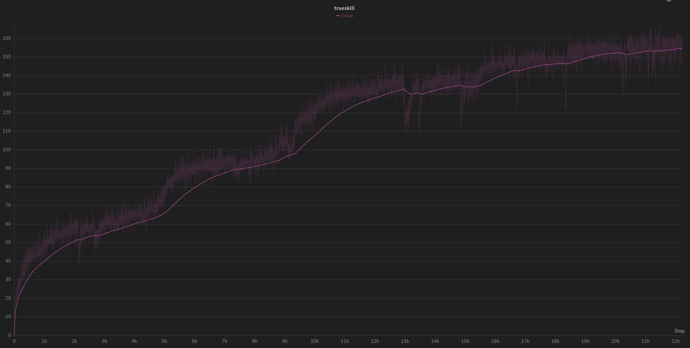
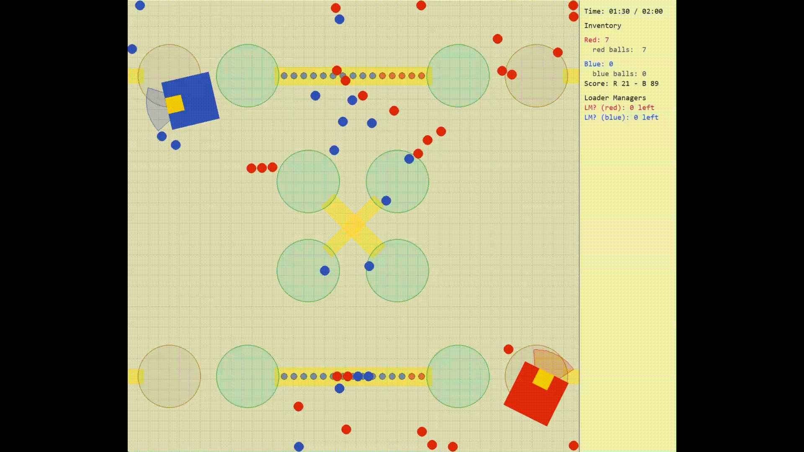

# VEXU V5 Pushback Strategy AI (SAI)

This repository is used to train and evaluate a strategy model for the VEXU V5 Pushback game using Self-play PPO. 

## Features

- **Custom Simulation**: Built with [pymunk](http://www.pymunk.org/) for physics-based simulation of the VEXU Pushback environment.
- **Asynchronous PPO Training**: Supports single-node, multi-process asynchronous PPO training
- **Evaluation with TrueSkill**: Model evaluation and ranking are performed using the TrueSkill rating system.

## Quick Start

   ```bash
   # Install uv (if you don't have it already)
   curl -LsSf https://astral.sh/uv/install.sh | sh 
   # install all dependencies
   uv sync 
   # start training with default config.
   uv run train.py
   ```
## Project Structure

- `env/` — Physics engine core & environment wrapper (same API as OpenAI Gym)
- `model/` — Pytorch model
- `trainer/` — Async PPO trainer, worker processes, shared buffer and league. 
- `evaluator/` — Async TrueSkill evaluator and rating 
- `train.py` — Main training entry point
- `train.sh` — Example SLURM script for cluster training
- `vis.py` — Visualise checkpoints with pygame

## Environment
The physics engine is built with Pymunk to best replicate VEX V5 Pushback. See more in `env/engine_core/` for more details. Environment wrapper has similar API to OpenAI i.e. `reset()`, `step()`. 

- **Observation**: There are two part to observations: `core` & `ball` observations. Core observation contains basic information about ego robot and opponent along with other attributes such as time, score, relative distance to goals, goal controls. Total core observation is 85 values. Ball observation is a unrodered set of 88 balls. Each ball observation include position, relative distance, colour and other goal-relative attribute. Each ball observation is 28 values. Note that observation for both players are red-canonical.See `env/observation_encoder.py` for more details.
- **Action**: We use a parameterised action space. Primary action is a discrete choice among 5 options: `move`, `score`, `block`, `pickup ground`, `pickup loader`. Only `move` is parameterised with a 2D Offset coordinate. Defalt config set X, Y to integer ranging between 0 - 21 producing 441 possible move actions. We also include rotation in similar fashion with translational offset. 
- **Reward**: We use a very simple reward scheme (see `env/env.py` for more details):
    - Score a ball: +0.6
    - Pickup ground or loader: +0.2 (to incentivise picking up more balls)
    - Long goal control: +2.0
    - CGL & CGU majority: +1.2 & +1.6 respectively.
    - Win: +5.0
    - Win margin bonus: +0.05 per point difference. 
    - To make the game zero-sum. Final reward for each robot is calculated as `reward = self_reward - opponent_reward`.

## Model Architecture
The model is a simple MLP with a "fancy" observation preprocess. We encode the core observation with a 2 FC layers. For the ball observation, we apply a single block for self-attention among the 88 balls then mean pool. The encoded core and ball observation are then concatenated to be processed by a thicker MLP before producing policy and value output. See `model/model.py` & `model/util.py` for more details.

## Training
There are 4 main components for training:
- **SharedBuffer**: A shared experience buffer that worker process write to. Trainer pull from this buffer to train the model asynchronously.
- **Worker**: Each worker runs an instance of the environment and 2 players (current model and opponent) to generate experience and write to the shared buffer.
- **SharedLeague**: A shared past opponent "bank" that orchestrate matches between current model and worker. Trainer push new version of model to the league every iteration and a model is added to the league to be used as opponent every 10 iterations. We use a simple dynamic sampling strategy used by [OpenAI Five](https://arxiv.org/pdf/1912.06680) Five using qualities. 
- **Trainer**: Pulls experience from the shared buffer to train the model. After every iteration, trainer pushes new version of model to the league and a model is added to the league to be used as opponent every 10 iterations.

**Note**: Since training is asynchronous, there are important 2 data qualities metric to keep track of:
- **Staleness**: Defined as M - N. M being the current model version being optimised by trainer and N being the model version used by worker to generate rollout. According to OpenAI Five, a staleness of 8 cause massive training slowdown. We observe similar trend, there for the current config aim for stalness below 1.
- **Sample Reuse**: Since training is asynchronous, if rollout generated is slow than trainer consumption, certain rollout may be used more than once for gradient updates. We track this metric by calculating:
```
sample_reuse = (samples trained per second) / (samples generated per second)
```
Again, similar to OpenAI Five, we observe sample reuse above 1 cause training slowdown. Current config aim for sample reuse below 1.

Depending on the hardware, you may need to increase or decrease number of workers to achieve optimal staleness and sample reuse.

## Evaluation
Evaluation is performed asynchronously with training. Eval workers continuously pull the latest model version from trainer to play against a set of reference agents and report [TrueSkill](https://trueskill.org/). Reference agents are fixed during evaluation with a trueskill of 0 representing random agent. New model versions are added to reference pool if latest model version achieve a trueskill above 5.0 compare to best reference agents. See `evaluator/` for more details.

## Recommended Hardware (for WPI Turing Cluster)
The goal is to achieve staleness and sample reuse at reasonable level also while balancing training time. But the more CPU cores the better since model is relatively small ~1M parameters and training is not bottlenecked by GPU.

The default config require 96 CPU cores and 1 GPU. 

# Random
Woah!



# Authors
Nguyen (Luca) Dang and Elene Kajaia
